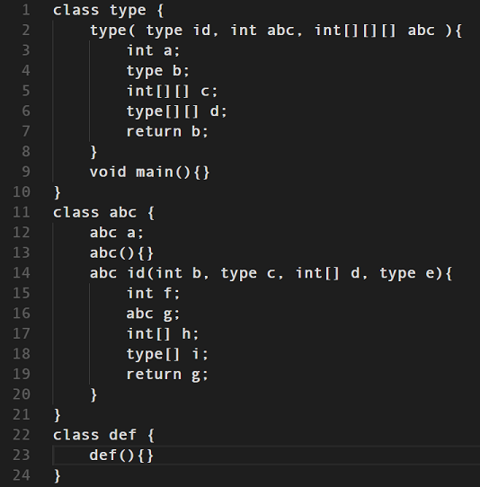
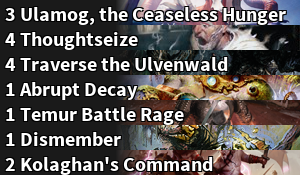

# Matt Grant

Hi, I'm Matt Grant, a software developer looking for somewhere in the industry to get my foot in the door.

## Projects

### Decaf Compiler Frontend

The frontend of a compiler made for a compilers course at the University of Wyoming.

[Full details](projects/decaf)

[Repo](https://github.com/DFXLuna/Decaf)

##### Highlights

* Demonstrates capacity for tackling difficult subjects
* Explicit use of object-oriented design for division of responsibility between moving parts.
* Clear example of familiarity with programming Linux.

### APT

A timewaster game developed in C# with Unity with auxiliary tools developed in Python. 

[Full details](projects/apt) 

[Repo](https://github.com/DFXLuna/APT)

##### Highlights

* Clean, object-oriented design with loose coupling and clear division of responsiblilty
* Quick turn around time for learning new language and framework
* Custom language interpreter built in C# and language syntax checker built in Python

### Stochastic A Star

###### Image credit [Julian Togelius](http://julian.togelius.com/mariocompetition2009/)

An implementation of the classic [A* algorithm](https://en.wikipedia.org/wiki/A*_search_algorithm) using the Mario AI 2009 engine.

[Full Details](https://github.com/DFXLuna/StochasticAStar/blob/master/README.md)

[Repo](https://github.com/DFXLuna/StochasticAStar)

##### Highlights

* Thorough documentation provided both for my code as well as many previously undocumented quirks and features of the engine.
* Innovation of the A Star algorithm using object-oriented best practices to help the algorithm mitigate unknown side effects applied to algorithm output

### mtgimg

A command line tool for generating clean looking decklist images of Magic: the Gathering cards.

[Full Details](projects/mtgimg.md)

[Repo](https://github.com/DFXLuna/mtgimg)

##### Highlights

* Clean interface accessible to inexperienced command line users
* Queries an API to gather image data
* Manipulates image data using PIL

### Contact

* [Resume](Resume.pdf)
* [LinkedIn](https://www.linkedin.com/in/matt-grant-708462b1/)
* [Email](mailto:teamuba@gmail.com)
* [Github](https://github.com/DFXLuna)
