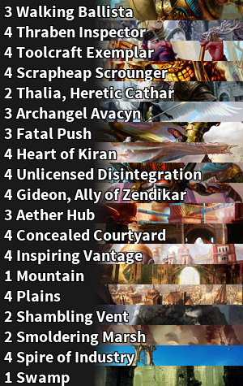

### mtgimg: A Stream Ready Decklist Generator

mtgimg was a small project I undertook to get experience working with Python.

#### Summary
The mtgimg script takes an input file where each line describes a quantity of card and a card name. It then outputs a list of those cards and quantities as single image where each card name has the image from the card in the background.

#### Main
The [main function](https://github.com/DFXLuna/mtgimg/blob/master/mtgimg.py#L19-95) uses getopt to process the arguments in the style of C's getopt. This extracts the input file name and any of the supported options including custom output file name, custom font, font size, as well as verbose mode for debugging.

After opening the file using the idiomatic Python style, regex is used in the [parseLine function](https://github.com/DFXLuna/mtgimg/blob/master/mtgimg.py#L147-154) to break up the card quantity from the card name. The card name is used to query the [mtgsdk API](https://github.com/MagicTheGathering/mtg-sdk-python) for the corresponding card image. The image is then sent to the [procCard function](https://github.com/DFXLuna/mtgimg/blob/master/mtgimg.py#L99-144) which cuts the image, sends it to the [alphaGrad function](https://github.com/DFXLuna/mtgimg/blob/master/mtgimg.py#L172-180) to apply the gradient and then returns it.

The images are then sorted, stitched together in the [output function](https://github.com/DFXLuna/mtgimg/blob/master/mtgimg.py#L158-168) and the final image is outputted.

#### Some Images
Here's a sample run using a real decklist from a tournament.



Input
```
3 Aether Hub
3 Archangel Avacyn
4 Concealed Courtyard
3 Fatal Push
4 Gideon, Ally of Zendikar
4 Heart of Kiran
4 Inspiring Vantage
1 Mountain
4 Plains
4 Scrapheap Scrounger
2 Shambling Vent
2 Smoldering Marsh
4 Spire of Industry
1 Swamp
2 Thalia, Heretic Cathar
4 Thraben Inspector
4 Toolcraft Exemplar
4 Unlicensed Disintegration
3 Walking Ballista
```